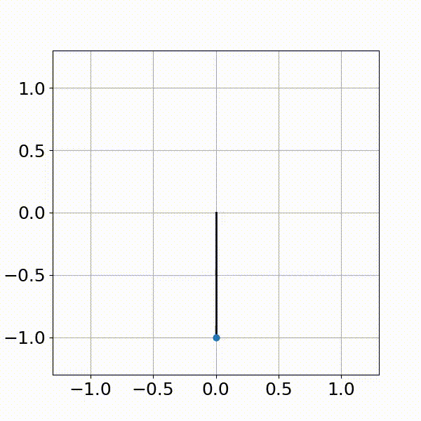
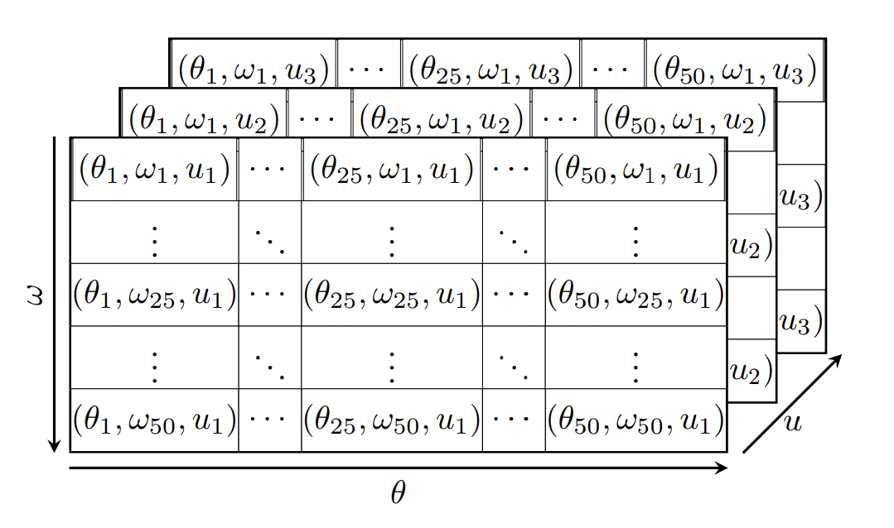

# Balancing the Pendulum
Implemented Q-learning with a Q-table to achieve desired position for simple pendulum

   

<em>Simulation of Simple Pendulum</em>
 

## Problem Formulation

The inverted pendulum has a limit on the maximum torque it can apply, therefore it is necessary for the pendulum to do a few "back and forth" motions to be able to reach the inverted position ( $\theta=\pi$ ) from the standing still non-inverted position ( $\theta=0$ ).

 

<em>Pendulum Model</em>
 

In the following,the vector of states of the system is given by:

$$x = \begin{pmatrix} 
\theta \\ 
\omega 
\end{pmatrix}$$

We will also work with time-discretized dynamics, and refer to $x_n$ as the state at time $t = n \Delta t$ (assuming discretization time $\Delta t$)

We want to minimize the following discounted cost function

$$\sum_{i=0}^{\infty} \alpha^i g(x_i, u_i)$$ where 

$$g(x_i, u_i) = (\theta-\pi)^2 + 0.01 \cdot \dot{\theta}_i^2 + 0.0001 \cdot u_i^2 $$ and $$\alpha=0.99$$

This cost mostly penalizes deviations from the inverted position but also encourages small velocities and control.

## Q-table

The Q-learning algorithm is implemented with a table. For the action value function given in equation, $Q(x_t, u_t)$ the assumptions are made such that $u$ can take only **three** possible values. For states $\theta$ can take any value in the range of ${[0,2\pi]}$ and that $\omega$ can take any value between ${[-6,6]}$. In order to build the table, we will need to discretize the states. So for the learning algorithm, we will use $\mathbf{50}$ discretized states for $\theta$ and $\mathbf{50}$ for $\omega.$ Hence the dimension of the Q-table will be of dimension $\mathbf{50x50x3}$.

   

<em>Q-table</em>
 

Q-table gives the quality of the state and action pair, where value of $Q$ is given by 

$$ Q(x_t,u_t)=g(x_t, u_t)+ \alpha \min_{u}Q(x_{t+1}, u) $$

To obtain next state in above equation, $x_{n+1}$ given $(x_n, u_n)$ a function is defined that integrates the pendulum for one step of $0.1$ seconds and returns the next state of the pendulum as a $2D$ numpy array at the end of the integration.

## Policy and value function

The action-value function combines all results of the single-stage predictive search. For each state-action pair, the optimal expected long-term return is displayed, allowing the selection of optimal actions without the knowledge of future states and their value, and thus without knowing anything about the dynamics of the environment.

$$ J^{*}(x_t) = \min_{u}Q(x_{t}, u) $$

$$ \mu^{*}(x) = arg \min_{u}Q(x_t, u) $$

Important for Reinforcement is that both, policy, as well as value function, can be learned and lead to a close optimal behavior.

## $\epsilon$-greedy policy
Epsilon-Greedy is a simple method to balance exploration and exploitation by choosing between exploration and exploitation randomly. In this method, epsilon refers to the probability of choosing to explore, exploits most of the time with a small chance of exploring given by:

$$
    u_t = \begin{cases}
            \textit{random action} & \textit{if probability } < \epsilon\\
            \textit{arg } \min_{u} Q(x_t, u), & \textit{else}  \\
          \end{cases}
$$

## Q-learning

Q-learning finds an optimal policy in the sense of maximizing the expected value of the total reward over any and all successive steps, starting from the current state. Temporal difference error is calculate over eachstep size using equation,

$$ \delta_{t} = g(x_t, u_t) + \alpha \min_{u}Q(x_{t+1}, u) - Q(x_t, u_t) $$

and the value of Q is updated by adding the product of learning rate and tempral difference error to Q as shown in equation,

$$ Q(x_t, u_t) \gets Q(x_t, u_t) + \gamma \delta_{t} $$

## When control $u \in \{-4,0,4\}$

By taking control $u \in \{-4,0,4\}$ and the model was trained for 10000 episodes keeping $\gamma = 0.1$ and $\epsilon = 0.3$. It can be observed from the plot of cost vs episodes that the model is taking around 5000 episodes to train after which it is stabilized. Also, the moving average of cost keeping window size equal to 100 is also plotted to get clarity on the behavior of cost over the episodes.

 

<em>Plot of cost vs episodes</em>
 

The pendulum took 2 swings to reach the inverted position in almost 3 seconds which can be observed from the plots of states w.r.t. time

 

<em>Plot of states vs time</em>
 

From the control plots, it can be observed that for the values of control in a given range it is taking more time to be at the same value of control during that time the pendulum is trying to attain momentum to reach the swing upward condition. When it is close to the desired condition it is taking less time to be at the same control value and after reaching the inverted position the control is oscillating at a high rate between an upper and lower limit which is equivalent to zero control.

To understand it in a better way we can compare the plot of omega with the plot of controls and understand that whenever the value of omega is positive, the control is positive and vice versa. 

 

<em>Plot of control vs time</em>
 

The plot of value function with respect to states can be observed that the value function is maximum when $\omega$ is zero and $\theta$ is at it's extreme values.

<!-- 

 

<em>Plot of Value Function </em>
  -->

The plot of policy, explains that whenever Velocity i.e $\omega$ is is positive the policy also has the positive value and and when velocity is negative, the policy is also negative except for few cases. 

<!-- 

 

<em>Plot of Policy</em>
  -->

|
 :--:|:--:
  *Plot of Value Function* |*Plot of Policy*

