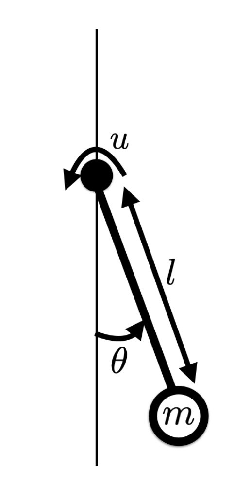

# Balancing the Pendulum
Implemented Q-learning with a Q-table to achieve desired position for simple pendulum

   

<em>Simulation of Simple Pendulum</em>
 

## Problem Formulation

The inverted pendulum has a limit on the maximum torque it can apply, therefore it is necessary for the pendulum to do a few "back and forth" motions to be able to reach the inverted position ( $\theta=\pi$ ) from the standing still non-inverted position ( $\theta=0$ ).

 

<em>Pendulum Model</em>
 

In the following, we will write 

$$x = \begin{pmatrix} 
\theta \\ 
\omega 
\end{pmatrix}$$ 
as the vector of states of the system. We will also work with time-discretized dynamics, and refer to $x_n$ as the state at time $t = n \Delta t$ (assuming discretization time $\Delta t$)

We want to minimize the following discounted cost function

$$\sum_{i=0}^{\infty} \alpha^i g(x_i, u_i)$$ where 

$g(x_i, u_i) = (\theta-\pi)^2 + 0.01 \cdot \dot{\theta}_i^2 + 0.0001 \cdot u_i^2 $ and $\alpha=0.99$.

This cost mostly penalizes deviations from the inverted position but also encourages small velocities and control.
